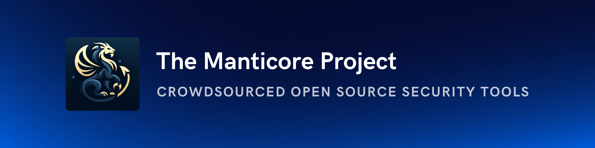

---

The Manticore Project is a collective of Go developers and security researchers dedicated to building offensive and defensive security tools, with the shared goal of strengthening the overall security posture of the community.

---

<h3>Libraries</h3>
<ul>
<li><a href="https://www.github.com/TheManticoreProject/winacl">winacl</a>: A library to work with Windows Security Descriptors</li>
<li><a href="https://www.github.com/TheManticoreProject/goopts">goopts</a>: A library to parse arguments given in command line to a program</li>
</ul>

---

<h3>Socials</h3>

You can find us on the following platforms:
 
<ul>
    <li>For general information and announcements:
        <ul>
            <li>Reddit: <a href="https://www.reddit.com/r/TheManticoreProject/">https://www.reddit.com/r/TheManticoreProject/</a></li>
            <li>LinkedIn: <a href="https://www.linkedin.com/company/themanticoreproject/">https://www.linkedin.com/company/themanticoreproject/</a></li>
            <li>Website: <a href="https://themanticoreproject.com/">https://themanticoreproject.com/</a></li>
        </ul>
    </li>
    <li>For code and development:
        <ul>
            <li>Github: <a href="https://github.com/TheManticoreProject">https://github.com/TheManticoreProject</a></li>
        </ul>
    </li>
    <li>For community and discussion:
        <ul>
            <li>Discord: <a href="https://discord.gg/TVmVFCp7ky">https://discord.gg/TVmVFCp7ky</a></li>
        </ul>
    </li>
</ul>

