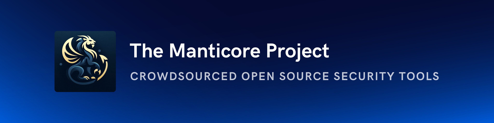

---

The Manticore Project is a collective of developers and security enthusiasts dedicated to building both offensive and defensive security tools, with the shared goal of strengthening the overall security posture of the community.

---

<h3>Libraries</h3>
<ul>
<li><a href="https://www.github.com/TheManticoreProject/winacl">winacl</a>: A cross platform Go library to work with Windows Security Descriptors</li>
<li><a href="https://www.github.com/TheManticoreProject/goopts">goopts</a>: A cross platform Go library to parse arguments given in command line to a program</li>
</ul>

---

## Socials

You can find us on the following platforms:

+ For general information and announcements:
    - Reddit: https://www.reddit.com/r/TheManticoreProject/
    - LinkedIn: https://www.linkedin.com/company/themanticoreproject/
    - Website: https://themanticoreproject.com/

+ For code and development:
    - Github: https://github.com/TheManticoreProject

+ For community and discussion:
    - Discord: https://discord.gg/TVmVFCp7ky
