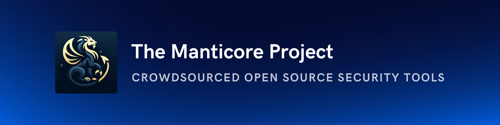

---

The Manticore Project is a collective of Go developers and security researchers dedicated to building offensive and defensive security tools, with the shared goal of strengthening the overall security posture of the community.

---

<h3>Tools</h3>
<ul>
    <li><a href="https://www.github.com/TheManticoreProject/manticore-adidns">manticore-adidns</a>: Query, add, modify, remove, and resurrect Active Directory-integrated DNS records (A, AAAA, NS, CNAME, SOA, SRV) and enumerate and inspect DNS zones on a domain controller over LDAP</li>
    <li><a href="https://www.github.com/TheManticoreProject/manticore-changepassword">manticore-changepassword</a>: Change and reset Active Directory account passwords (plaintext or NTLM hashes) on domain controllers over MS-SAMR (SMB or MS-RPC transport) and LDAP</li>
    <li><a href="https://www.github.com/TheManticoreProject/manticore-cve">manticore-cve</a>: CVE exploitation toolkit with a hierarchical command structure to list available years and CVE IDs and run individual CVE exploitation modules</li>
    <li><a href="https://www.github.com/TheManticoreProject/manticore-keycredentials">manticore-keycredentials</a>: Create, enroll, attach, describe, list, find, extract, remove, and flush shadow credentials (msDS-KeyCredentialLink entries, their RSA key material, and device IDs) on Active Directory accounts over LDAP</li>
    <li><a href="https://www.github.com/TheManticoreProject/manticore-msrpc">manticore-msrpc</a>: Enumerate, monitor, and fuzz MS-RPC interfaces through a target's endpoint mapper</li>
    <li><a href="https://www.github.com/TheManticoreProject/manticore-registry">manticore-registry</a>: Read, write, search, back up, compare, secure, and live-monitor the Windows registry (keys, values, and ACLs) on remote hosts over MS-RRP (the Remote Registry protocol, \winreg over DCE/RPC over SMB)</li>
    <li><a href="https://www.github.com/TheManticoreProject/manticore-sidtool">manticore-sidtool</a>: Convert, describe, and look up Windows Security Identifiers (revision level, identifier authority, sub-authorities, and relative identifier) in their string, hexadecimal, base64, and raw bytes representations</li>
    <li><a href="https://www.github.com/TheManticoreProject/manticore-smbexec">manticore-smbexec</a>: Run commands and open a semi-interactive shell as SYSTEM (cmd and PowerShell payloads, output staged on a writable share) on remote Windows hosts over MS-SCMR</li>
    <li><a href="https://www.github.com/TheManticoreProject/manticore-zerologon">manticore-zerologon</a>: Detect and exploit the Zerologon authentication bypass (CVE-2020-1472) on Active Directory domain controllers over MS-NRPC</li>
    </ul>

<h3>Libraries</h3>
<ul>
    <li><a href="https://www.github.com/TheManticoreProject/Manticore">Manticore</a>: A cross platform library to write offensive and defensive security tools in Go </li>
    <li><a href="https://www.github.com/TheManticoreProject/gopengraph">gopengraph</a>: A Go library to create BloodHound OpenGraphs easily </li>
    <li><a href="https://www.github.com/TheManticoreProject/goopts">goopts</a>: A library to parse arguments given in command line to a program </li>
    <li><a href="https://www.github.com/TheManticoreProject/winacl">winacl</a>: A library to work with Windows Security Descriptors </li>
</ul>

---

<h3>Socials</h3>

You can find us on the following platforms:
 
<ul>
    <li>For general information and announcements:
        <ul>
            <li>Reddit: <a href="https://www.reddit.com/r/TheManticoreProject/">https://www.reddit.com/r/TheManticoreProject/</a></li>
            <li>LinkedIn: <a href="https://www.linkedin.com/company/themanticoreproject/">https://www.linkedin.com/company/themanticoreproject/</a></li>
            <li>Website: <a href="https://themanticoreproject.com/">https://themanticoreproject.com/</a></li>
            <li>YouTube: <a href="https://www.youtube.com/@The-Manticore-Project">https://www.youtube.com/@The-Manticore-Project</a></li>
        </ul>
    </li>
    <li>For code and development:
        <ul>
            <li>Github: <a href="https://github.com/TheManticoreProject">https://github.com/TheManticoreProject</a></li>
        </ul>
    </li>
    <li>For community and discussion:
        <ul>
            <li>Discord: <a href="https://discord.gg/w8TNWB6TNb">https://discord.gg/w8TNWB6TNb</a></li>
        </ul>
    </li>
</ul>

